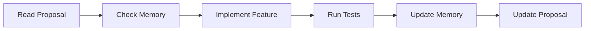
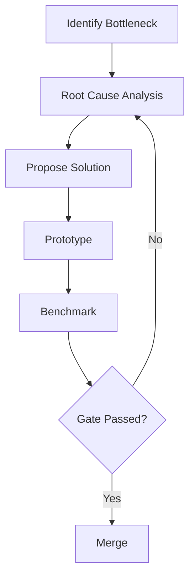

# 🤖 Agent Instructions - Apex Project

> **Version:** 1.0.0
> **Last Updated:** 2026-01-28
> **For:** AI Agents (Claude, GPT, Gemini, etc.)

---

## 📋 Table of Contents

1. [Project Overview](#-project-overview)
2. [Directory Structure](#-directory-structure)
3. [MCP Tools Usage](#-mcp-tools-usage)
4. [Workflows](#-workflows)
5. [Data Templates](#-data-templates)
6. [Metadata Conventions](#-metadata-conventions)
7. [Code Standards](#-code-standards)
8. [Performance Invariants](#-performance-invariants)

---

## 🎯 Project Overview

**Apex** là high-performance Rust reverse proxy với mục tiêu:
- Vượt Traefik 3-5x về throughput và latency
- Lock-free data plane, zero-copy request handling
- Auto TLS (ACME/Let's Encrypt)
- Hot reload config không downtime

### Quick Facts
| Attribute | Value |
|-----------|-------|
| Language | Rust 1.75+ (MSRV) |
| Runtime | tokio 1.x |
| HTTP | hyper 1.x |
| TLS | rustls 0.23 |
| Architecture | Multi-crate workspace |

---

## 📁 Directory Structure

```
apex/
├── .tools/                     ← 🛠️ Development tools
│   ├── mcp/                    ← MCP server (thinking tools)
│   │   ├── src/
│   │   ├── Cargo.toml
│   │   └── target/release/thinking-mcp.exe
│   ├── data/
│   │   └── memory.json         ← Persistent knowledge graph
│   └── AGENT_INSTRUCTIONS.md   ← THIS FILE
│
├── .vscode/
│   ├── mcp.json                ← MCP server configuration
│   ├── tasks.json              ← Build tasks
│   └── settings.json
│
├── docs/
│   ├── IDEA.md                 ← Original concept
│   ├── plan/                   ← Discussion documents
│   │   └── discussion_idea_*.md
│   └── proposal/
│       ├── Proposed-Template.md
│       └── Proposed-Apex.md       ← 📋 MASTER PROPOSAL
│
├── crates/                     ← 📦 Source code (multi-crate)
│   ├── apex/                   ← Binary crate
│   ├── core/                   ← HOT PATH (minimal deps)
│   ├── config/                 ← Control Plane
│   ├── server/                 ← HTTP server
│   ├── pool/                   ← Connection pooling
│   ├── tls/                    ← TLS + ACME
│   ├── middleware/             ← Tower layers
│   ├── lb/                     ← Load balancing
│   ├── metrics/                ← Observability
│   └── proto/                  ← STABLE ABI (#![no_std])
│
├── benches/                    ← Benchmarks
├── tests/integration/          ← Integration tests
└── xtask/                      ← Build automation
```

---

## 🔧 MCP Tools Usage

### Memory Tools (Knowledge Graph)

Dùng để lưu trữ và truy vấn kiến thức dự án giữa các session.

#### When to Use

| Tool | Use Case |
|------|----------|
| `memory_create_entities` | Lưu concept mới (decision, risk, task) |
| `memory_add_observations` | Thêm facts vào entity có sẵn |
| `memory_create_relations` | Liên kết entities |
| `memory_search_nodes` | Tìm kiếm theo keyword |
| `memory_read_graph` | Xem toàn bộ knowledge graph |
| `memory_open_nodes` | Mở specific nodes by name |

#### Entity Types (Recommended)

```
Project      → Thông tin tổng quan dự án
Constraint   → Luật sắt, invariants
Metric       → Performance gates, targets
Architecture → Cấu trúc, design patterns
Analysis     → Bottleneck analysis, research
Risk         → Issues, threats
Dependency   → Tech stack, crates
Milestone    → Phase tasks, timeline
Decision     → Decision log với date
```

#### Relation Types (Recommended)

```
must_follow      → Constraint relationship
must_achieve     → Target relationship
uses             → Dependency relationship
addresses        → Problem-solution relationship
targets          → Goal relationship
threatens        → Risk relationship
documents        → Recording relationship
informs          → Data flow relationship
designed_to_solve → Causal relationship
```

#### Example: Save New Decision

```typescript
// Create entity
memory_create_entities([{
  entityType: "Decision",
  name: "UseRadixRouter",
  observations: [
    "2026-01-28: Chose radix tree over sequential matching",
    "O(log n) vs O(n) complexity",
    "Decided by: Team consensus"
  ]
}])

// Link to project
memory_create_relations([{
  from: "UseRadixRouter",
  relationType: "improves",
  to: "TraefikBottlenecks"
}])
```

### Thinking Tools

#### Sequential Thinking
Dùng cho complex multi-step problems:
```typescript
sequentialthinking({
  thought: "Step 1: Analyze the problem...",
  thoughtNumber: 1,
  totalThoughts: 5,
  nextThoughtNeeded: true,
  thinkingMethod: "sequential"
})
```

#### Six Thinking Hats
Dùng cho decision making:
- 🎩 **White** → Facts, data
- 🎩 **Red** → Emotions, intuition
- 🎩 **Black** → Risks, problems
- 🎩 **Yellow** → Benefits, optimism
- 🎩 **Green** → Creativity, alternatives
- 🎩 **Blue** → Process, summary

#### Critical Thinking
Dùng cho evaluating claims:
```typescript
critical_thinking({
  claim: "Arena allocation eliminates GC pressure",
  evidence: ["bumpalo benchmarks", "Traefik profiling"],
  assumptions: ["Single-threaded arena per request"],
  counterarguments: ["Lifetime complexity with async"],
  logical_fallacies: [],
  credibility_assessment: "High - based on benchmarks",
  conclusion: "Valid with proper lifetime management",
  confidence_level: 75,
  next_analysis_needed: true
})
```

#### Root Cause Analysis
Dùng cho debugging/postmortem:
```typescript
root_cause_analysis({
  problem_statement: "P99 latency spike during config reload",
  symptoms: ["500μs → 5ms spike", "Occurs every 30s"],
  immediate_causes: ["RwLock contention"],
  root_causes: ["Global lock on config"],
  // ... more fields
})
```

---

## 🔄 Workflows

### 1. Build MCP Tools

```bash
# Quick build (default task)
Ctrl+Shift+B

# Or manually
cd .tools/mcp
cargo build --release
```

### 2. Development Cycle



**Steps:**
1. **Read Proposal**: Check `docs/proposal/Proposed-Proxy-Now.md`
2. **Check Memory**: `memory_read_graph` hoặc `memory_search_nodes`
3. **Implement**: Code trong `crates/`
4. **Test**: `cargo test -p <crate>`
5. **Update Memory**: Lưu decisions, issues
6. **Update Proposal**: Mark tasks done, add findings

### 3. Discussion Workflow

Khi cần thảo luận với user về design decisions:

1. **Gather Context**: Read proposal + memory
2. **Present Options**: Dùng Six Thinking Hats
3. **Analyze Trade-offs**: Dùng Critical Thinking
4. **Document Decision**: Save to memory + proposal

### 4. Performance Investigation



---

## 📝 Data Templates

### Decision Record

```markdown
## Decision: [Title]

**Date:** YYYY-MM-DD
**Status:** Proposed | Accepted | Rejected | Superseded
**Deciders:** [Names/AI]

### Context
[Why this decision is needed]

### Options Considered
1. **Option A**: [Description]
   - Pros: ...
   - Cons: ...
2. **Option B**: ...

### Decision
[What was decided and why]

### Consequences
- [Positive/Negative impacts]
```

### Risk Record

```markdown
## Risk: [Title]

| Attribute | Value |
|-----------|-------|
| Likelihood | Low/Medium/High |
| Impact | Low/Medium/High/Critical |
| Status | Open/Mitigated/Accepted |

### Description
[What is the risk]

### Mitigation
[How to reduce likelihood/impact]

### Contingency
[What to do if risk materializes]
```

### Task Record (Proposal)

```markdown
| # | Task | Output | Est. Time | Status |
|---|------|--------|-----------|--------|
| 1.1 | [Description] | [Deliverable] | Xh | ⬜/🔄/✅ |
```

Status icons:
- ⬜ Not started
- 🔄 In progress
- ✅ Completed
- ❌ Blocked

---

## 📊 Metadata Conventions

### File Headers

```markdown
# [Title]

> **Status:** Draft | Review | Approved
> **Date:** YYYY-MM-DD
> **Author:** [Name]
> **Reviewed by:** [Names]
```

### Code Comments

```rust
// ========== SECTION NAME ==========
/// Brief description
/// 
/// # Arguments
/// * `arg` - Description
/// 
/// # Returns
/// Description
/// 
/// # Panics
/// When this panics (MUST document if panic possible)
/// 
/// # Performance
/// O(1) / O(n) / Lock-free / etc.
pub fn function() {}
```

### Commit Messages

```
<type>(<scope>): <subject>

<body>

<footer>
```

Types:
- `feat`: New feature
- `fix`: Bug fix
- `perf`: Performance improvement
- `refactor`: Code refactoring
- `docs`: Documentation
- `test`: Tests
- `chore`: Build/tooling

Example:
```
perf(core): replace HashMap with DashMap for lock-free TLS cache

- Eliminates RwLock contention identified in Traefik bottleneck #1
- Benchmark shows 2.3x improvement under high concurrency

Closes #42
```

---

## 💻 Code Standards

### Crate-Specific Rules

| Crate | Deps Allowed | Async | Allocations |
|-------|--------------|-------|-------------|
| `proto` | None (#![no_std]) | ❌ | ❌ |
| `core` | Minimal | Limited | Arena only |
| `lb` | proto, core | ❌ | Pre-allocated |
| `pool` | core, tokio | ✅ | Pooled |
| `*` (others) | Any | ✅ | Normal |

### Error Handling

```rust
// ❌ NEVER in hot path
fn bad() {
    let x = some_option.unwrap();  // Panic on None
    let y = some_result.expect("msg");  // Panic on Err
}

// ✅ ALWAYS
fn good() -> Result<T, ProxyError> {
    let x = some_option.ok_or(ProxyError::InvalidRequest)?;
    let y = some_result.map_err(|_| ProxyError::BackendUnavailable)?;
    Ok(result)
}
```

### Naming Conventions

```rust
// Types: PascalCase
struct RequestContext {}
enum ProxyError {}
trait ConnectionPool {}

// Functions: snake_case
fn handle_request() {}

// Constants: SCREAMING_SNAKE_CASE
const MAX_CONNECTIONS: usize = 1000;

// Modules: snake_case
mod connection_pool;

// Crates: kebab-case in Cargo.toml
# proxy-core, proxy-tls
```

---

## ⚠️ Performance Invariants

> **LUẬT SẮT - KHÔNG ĐƯỢC VI PHẠM**

### ❌ BANNED trong Data Plane

| Pattern | Why Banned | Alternative |
|---------|------------|-------------|
| `Mutex`/`RwLock` | Lock contention | `ArcSwap`, `DashMap` |
| `Box::new()` per request | Allocation pressure | `bumpalo` arena |
| `Box<dyn Service>` | Virtual dispatch | Generic `S: Service` |
| `clone()` on headers/body | Memory bandwidth | Borrow, `Bytes` slice |
| `unwrap()`/`expect()` | Panic = crash | `?` operator |
| Blocking I/O | Thread starvation | `tokio::spawn` |

### ✅ REQUIRED Patterns

| Pattern | Implementation |
|---------|----------------|
| Lock-free config | `arc_swap::ArcSwap<Config>` |
| Zero-copy buffers | `bytes::Bytes::slice()` |
| Per-request arena | `bumpalo::Bump::new()` |
| Generic middleware | `tower::Layer<S>` |
| Lock-free cache | `dashmap::DashMap` |

### Performance Gates

| Phase | Throughput | P99 | vs Traefik |
|-------|------------|-----|------------|
| 1 | >100k RPS | <500μs | ≥1.5x |
| 2 | >200k RPS | <200μs | ≥3x |
| 3 | >300k RPS | <100μs | ≥5x |

**Không đạt gate = Không ship**

---

## 🔍 Quick Reference

### Common MCP Commands

```typescript
// Read all memory
memory_read_graph()

// Search for specific topic
memory_search_nodes({ query: "bottleneck" })

// Add new decision
memory_create_entities([{
  entityType: "Decision",
  name: "DecisionName",
  observations: ["Date: ...", "What: ...", "Why: ..."]
}])

// Link entities
memory_create_relations([{
  from: "EntityA",
  relationType: "affects",
  to: "EntityB"
}])
```

### Key Files to Read

1. `docs/proposal/Proposed-Apex.md` - Master proposal
2. `.tools/data/memory.json` - Knowledge graph
3. `docs/plan/discussion_*.md` - Design discussions
4. `crates/*/Cargo.toml` - Crate dependencies

### Before Starting Work

1. ✅ Read this file
2. ✅ Check `memory_read_graph()` for context
3. ✅ Read relevant proposal section
4. ✅ Understand invariants
5. ✅ Check existing decisions

---

*Last Updated: 2026-01-28*
